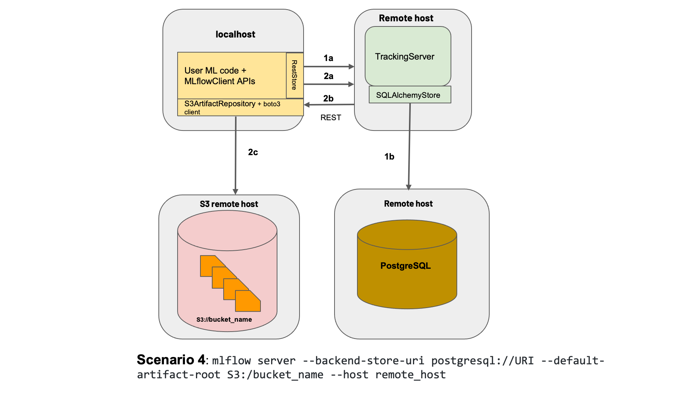
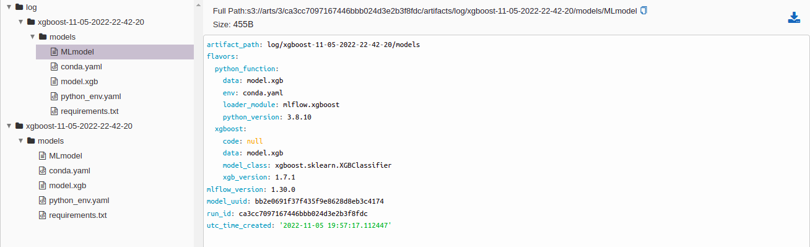
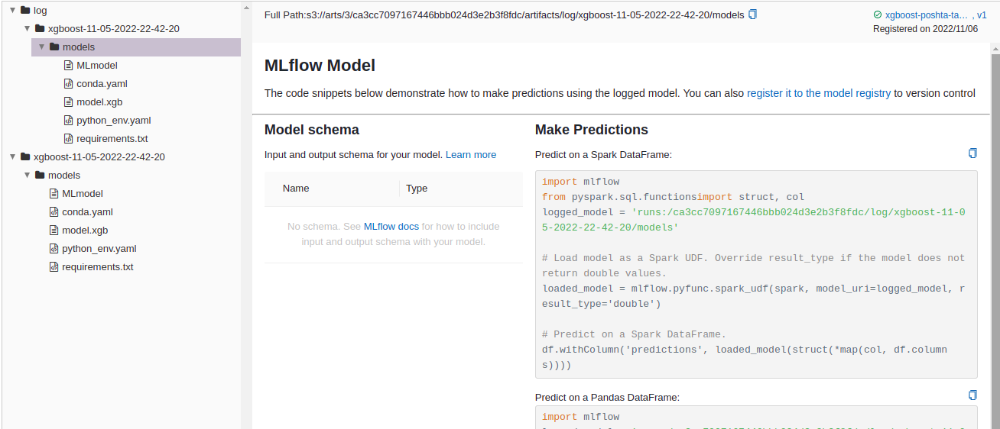

# TableBC
**Development of a model for predicting the loss of postal items**

# Project structure

Our solution consists of one main parts:

**Сlassifier** - solving a classification problem:
 - 1 - operation, on which the digital trace was terminated, because shipment lost
 - 0 - the shipment was delivered or returned sender

This rep presents three methods for solving the problem:
1. Using Catboost 
2. Using XGBoost

```
.
├── data
├── notebooks               <- Jupyter notebooks
├── README.md               <- The top-level README for developers using this project
├── requirements.txt        <- The requirements file for reproducing the analysis environment
├── log                     <- Logging training and validation results
├── src
│   ├── СatBoost            <- Folder that contains catboost solution
│   ├── XGBoost             <- Folder that contains xgboost solution
│   ├── XGBoost             <- Folder that contains configs for model and data type fields
│   ├── utils
└── tutorial.ipynb          <- Demonstration work
```

# MLFlow 
To track the results of experiments, we used MLFlow. MLFlow - an open source platform for the machine learning lifecycle. We used the architecture shown below in the picture. 



With the help of MLFlow, the following tasks were solved:
1. Collect summary information

2. Save artifacts
 
3. Manage machine learning models (in process)

# Metrics
**Classification task**
|Model|Precision|Recall|Accuracy_public_dataset|Metric_competition_private_dataset|
|:------|:-------|:------|:-------|:------|
|Catboost|0.717|0.584|0.982|0.657388|
|XGBoost|0.717|0.584|0.982|0.664144|
|XGBoost_with_threshold|0.51|0.9|0.973|0.723403|

**Metric_competition** = 0.7 * Recall + 0.9 * AUC_ROC

# Usage
We tested three different models:
- CatBoost
- XGBoost

Sava artifacts
You can combine them however you like. Be careful with experiments, look at the results.

Before using it, you need to install the project dependencies:
```
pip install -r requirements.txt 
```

How to load model weights from mlflow and make predictions can be found in [tutorial.ipynb](./tutorial.ipynb) 

To connect to mlflow, you need to create an .env folder in the root directory (example [.env.example](./.env.example) ). To use the connection parameter to mlflow, you can write to the authors of this work

# Reference 
1. [Competition](https://hacks-ai.ru/championships/758467)
2. [CatBoost](https://catboost.ai/)
3. [XGBoost](https://xgboost.readthedocs.io/en/stable/index.html)
4. [mlflow](https://mlflow.org/)

